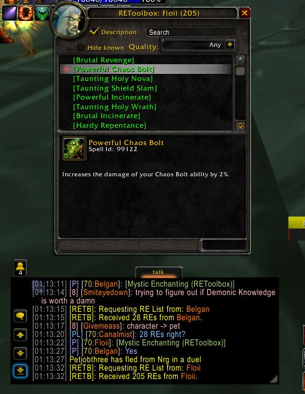
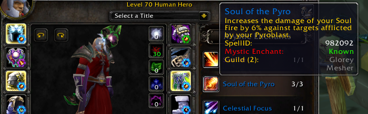
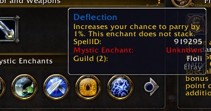
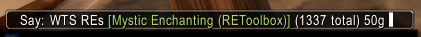
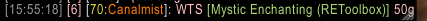

# REToolbox
An addon for Ascension Classless realms. Allows you to see if characters on your account or your guildies have a particular Mystic Enchant in their collection.

## Download

ZIP files found in [Latest Releases (0.0.3b)](https://github.com/Nihilianth/REToolbox/releases/tag/v0.0.3b_apply_extract) already contain the required libraries . If you already have DataStore ``r26`` or DataStore_AscensionRE v0.0.2 (``e07340d``) you don't have to replace them.

## New in version 0.0.3b: Character Pane Highlights, RE Collection Linking / UI, colored spell names

### GUI / RE Collection linking
This update introduces a new UI for REToolbox (``/re``). It allows you to view and search through RE collections. Following collections can be accessed:

- Your RE Collection
- RE Collection of alts on the same account
- All REs available ingame
- RE Collections shared via chat link

Using the UI or console command you can create a chat link that allows other users of this addon to inspect your RE collection. 
_Note: Chat links expire after 5 minutes. If you wish to create a spammable macro, see below._

### Character pane highlights
Hovering over RE icons in character panel will now highlight equipped items with this RE applied.

### Colored RE Names in tooltips
RE Spell Names in tooltips (e.g. within Build viewer) will now be colored based on their quality.

### Creating a macro link
The generated RE Collection links have an expiration timer, so to create an advertisement macro containing a link to your collection requires some modification. To create a macro for broadcasting, you can use one of thefollowing commands:

- _Has to be called from a macro, not from chat paste._ This opens an edit frame and inserts the link, leaving it editable. Current channel is used (whisper / world / say).

    ``/run RETBLinkPrint("WTS REs %s (1337 total) 50g ")``
    
- Posts a message to a pre-set channel. Replace ``<channel number>`` with the desired one and change COMMON to ORCISH if needed.
  
    ``/script SendChatMessage(format("WTS %s 50g", RETBGetNewLink()), "CHANNEL", "COMMON", "<channel number>")``
    

_``%s`` will be replaced with Collection link_

## New in Version 0.0.2b: Item tooltips

You can now see RE information while browsing Auction House items and viewing bags / item links.

### Addon description
Based around [DataStore r26](https://www.curseforge.com/wow/addons/datastore/files/437591) aswell as the custom module [DataStore_AscensionRE](https://github.com/Nihilianth/DataStore_AscensionRE)

After installing this addon the RE tooltips will reflect if your alts or your guildies (using this addon) have this certain RE in their collection.

This addon will provide you a link to the new RE after adding it to your collection. You are also be able to check if your current character has an enchant before attempting to extract it.

This addon is still under development, with new features planned for the future. Feel free to spread the word around Ascension and notify me about any issues you encounter. Message Nihilianth on Ascension Discord if you have further questions.
